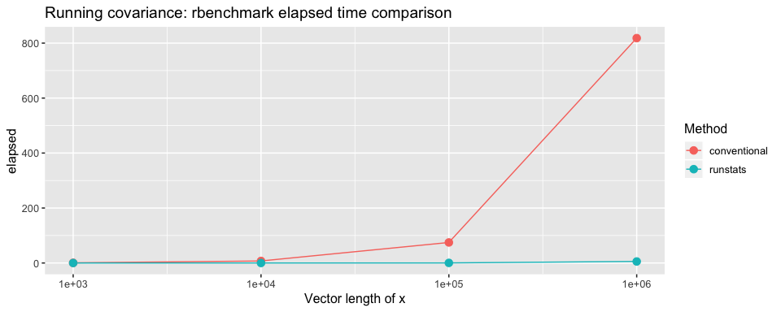

[](https://travis-ci.com/martakarass/runstats) [](https://ci.appveyor.com/project/martakarass/runstats) [](https://codecov.io/github/martakarass/runstats?branch=master)

<!-- README.md is generated from README.Rmd. Please edit that file -->
runstats
========

Package `runstats` provides methods for fast computation of running sample statistics for time series. The methods utilize Convolution Theorem to compute convolutions via Fast Fourier Transform (FFT). Implemented running statistics include:

1.  mean,
2.  standard deviation,
3.  variance,
4.  covariance,
5.  correlation,
6.  Euclidean distance.

### Installation

``` r
devtools::install_github("martakarass/runstats")
```

### Usage

``` r
library(runstats)

## Example: running correlation
x0 <- sin(seq(0, 2 * pi * 5, length.out = 1000))
x  <- x0 + rnorm(1000, sd = 0.1)
pattern <- x0[1:100]
out1 <- RunningCor(x, pattern)
out2 <- RunningCor(x, pattern, circular = TRUE)

## Example: running mean
x <- cumsum(rnorm(1000))
out1 <- RunningMean(x, W = 100)
out2 <- RunningMean(x, W = 100, circular = TRUE)
```

### Running statistics

To better explain the concept of running statistics, package's function `runstats.demo(func.name)` allows to vizualize how the output of each running statistics method is generated. To run the demo, use `func.name` being one of the methods' names:

1.  `"RunningMean"`,
2.  `"RunningSd"`,
3.  `"RunningVar"`,
4.  `"RunningCov"`,
5.  `"RunningCor"`,
6.  `"RunningL2Norm"`.

``` r
## Example: demo for running correlation method  
runstats.demo("RunningCor")
```


``` r
## Example: demo for running mean method 
runstats.demo("RunningMean")
```


### Performance

To give a sense of `runstats` package's methods performance, we use `rbenchmark` to measure elapsed time of `RunningCov` method execution, for different lengths of `x` time-series and fixed length of the short time-series `y`.

``` r
library(rbenchmark)

set.seed (20181010)
x.N.seq <- 10^(3:7)
x.list  <- lapply(x.N.seq, function(N) runif(N))
y <- runif(100)

## Benchmark execution time of RunningCov 
out.df <- data.frame()
for (x.tmp in x.list){
  out.df.tmp <- benchmark("runstats" = runstats::RunningCov(x.tmp, y),
                          replications = 10,
                          columns = c("test", "replications", "elapsed",
                                      "relative", "user.self", "sys.self"))
  out.df.tmp$x_length <- length(x.tmp)
  out.df <- rbind(out.df, out.df.tmp)
}
```

``` r
out.df
#>       test replications elapsed relative user.self sys.self x_length
#> 1 runstats           10   0.003        1     0.002    0.000     1000
#> 2 runstats           10   0.029        1     0.024    0.006    10000
#> 3 runstats           10   0.387        1     0.328    0.058   100000
#> 4 runstats           10   6.304        1     5.917    0.359  1000000
#> 5 runstats           10 126.605        1   120.697    5.616 10000000
```

##### Compare with a conventional method

To give a sense how the method compares with "conventional" way of computing running covariance in `R`, we use `rbenchmark` package to measure elapsed time of `RunningCov` and `RunningCov.conv` execution, for different lengths of `x` time-series and fixed length of the short time-series `y`.

As conventional approach takes more time, we limit ourselves to short grid of lengths of `x` time-series considered.

``` r
## Conventional approach 
RunningCov.conv <- function(x, y){
  l_x <- length(x)
  l_y <- length(y)
  sapply(1:(l_x - l_y + 1), function(i){
    cov(x[i:(i+l_y-1)], y)
  })
}

set.seed (20181010)

out.df2 <- data.frame()
for (x.tmp in x.list[c(1,2,3,4)]){
  out.df.tmp <- benchmark("conventional" = RunningCov.conv(x.tmp, y),
                          "runstats" = runstats::RunningCov(x.tmp, y),
                          replications = 10,
                          columns = c("test", "replications", "elapsed",
                                      "relative", "user.self", "sys.self"))
  out.df.tmp$x_length <- length(x.tmp)
  out.df2 <- rbind(out.df2, out.df.tmp)
}
```

Benchmark results

``` r
library(ggplot2)
ggplot(out.df2, aes(x = x_length, y = elapsed, color = test)) + 
  geom_line() +  geom_point(size = 3) +  scale_x_log10() + 
  theme_gray(base_size = 12) + 
  labs(x = "Vector length of x",
       y = "elapsed", color = "Method", 
       title = "Running covariance: rbenchmark elapsed time comparison")
```



Platform information

``` r
sessioninfo::platform_info()
#>  setting  value                       
#>  version  R version 3.5.1 (2018-07-02)
#>  os       OS X El Capitan 10.11.6     
#>  system   x86_64, darwin15.6.0        
#>  ui       X11                         
#>  language (EN)                        
#>  collate  en_US.UTF-8                 
#>  ctype    en_US.UTF-8                 
#>  tz       America/New_York            
#>  date     2018-10-10
```
