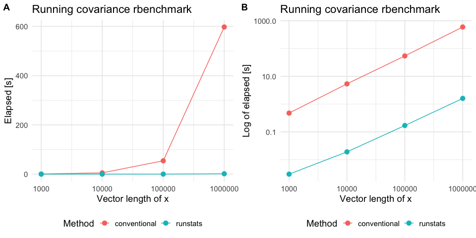

[](https://travis-ci.com/martakarass/runstats)
[](https://ci.appveyor.com/project/martakarass/runstats)
[](https://codecov.io/github/martakarass/runstats?branch=master)
[](https://cran.r-project.org/package=runstats)
[](https://cran.r-project.org/package=runstats)

<!-- README.md is generated from README.Rmd. Please edit that file -->

# runstats

Package `runstats` provides methods for fast computation of running
sample statistics for time series. The methods utilize Convolution
Theorem to compute convolutions via Fast Fourier Transform (FFT).
Implemented running statistics include:

1.  mean,
2.  standard deviation,
3.  variance,
4.  covariance,
5.  correlation,
6.  euclidean distance.

### Website

Package website is located
[here](https://martakarass.github.io/runstats/).

### Installation

``` r
# devtools::install_github("martakarass/runstats")
install.packages("runstats")
```

### Usage

``` r
library(runstats)

## Example: running correlation
x0 <- sin(seq(0, 2 * pi * 5, length.out = 1000))
x  <- x0 + rnorm(1000, sd = 0.1)
pattern <- x0[1:100]
out1 <- RunningCor(x, pattern)
out2 <- RunningCor(x, pattern, circular = TRUE)

## Example: running mean
x <- cumsum(rnorm(1000))
out1 <- RunningMean(x, W = 100)
out2 <- RunningMean(x, W = 100, circular = TRUE)
```

### Running statistics

To better explain the details of running statistics, package’s function
`runstats.demo(func.name)` allows to visualize how the output of each
running statistics method is generated. To run the demo, use `func.name`
being one of the methods’ names:

1.  `"RunningMean"`,
2.  `"RunningSd"`,
3.  `"RunningVar"`,
4.  `"RunningCov"`,
5.  `"RunningCor"`,
6.  `"RunningL2Norm"`.

<!-- end list -->

``` r
## Example: demo for running correlation method  
runstats.demo("RunningCor")
```


``` r
## Example: demo for running mean method 
runstats.demo("RunningMean")
```


### Performance

We use `rbenchmark` to measure elapsed time of `RunningCov` execution,
for different lengths of time-series `x` and fixed length of the shorter
pattern `y`.

``` r
library(rbenchmark)

set.seed (20181010)
x.N.seq <- 10^(3:7)
x.list  <- lapply(x.N.seq, function(N) runif(N))
y <- runif(100)

## Benchmark execution time of RunningCov 
out.df <- data.frame()
for (x.tmp in x.list){
  out.df.tmp <- benchmark("runstats" = runstats::RunningCov(x.tmp, y),
                          replications = 10,
                          columns = c("test", "replications", "elapsed",
                                      "relative", "user.self", "sys.self"))
  out.df.tmp$x_length <- length(x.tmp)
  out.df.tmp$pattern_length <- length(y)
  out.df <- rbind(out.df, out.df.tmp)
}
```

``` r
knitr::kable(out.df)
```

| test     | replications | elapsed | relative | user.self | sys.self | x\_length | pattern\_length |
| :------- | -----------: | ------: | -------: | --------: | -------: | --------: | --------------: |
| runstats |           10 |   0.005 |        1 |     0.004 |    0.001 |      1000 |             100 |
| runstats |           10 |   0.023 |        1 |     0.018 |    0.004 |     10000 |             100 |
| runstats |           10 |   0.194 |        1 |     0.158 |    0.037 |    100000 |             100 |
| runstats |           10 |   1.791 |        1 |     1.656 |    0.125 |   1000000 |             100 |
| runstats |           10 |  20.234 |        1 |    17.660 |    2.514 |  10000000 |             100 |

##### Compare with a conventional method

To compare `RunStats` performance with “conventional” loop-based way of
computing running covariance in `R`, we use `rbenchmark` package to
measure elapsed time of `RunStats::RunningCov` and running covariance
implemented with `sapply` loop, for different lengths of time-series `x`
and fixed length of the shorter time-series `y`.

``` r
## Conventional approach 
RunningCov.sapply <- function(x, y){
  l_x <- length(x)
  l_y <- length(y)
  sapply(1:(l_x - l_y + 1), function(i){
    cov(x[i:(i+l_y-1)], y)
  })
}

set.seed (20181010)

out.df2 <- data.frame()
for (x.tmp in x.list[c(1,2,3,4)]){
  out.df.tmp <- benchmark("conventional" = RunningCov.sapply(x.tmp, y),
                          "runstats" = runstats::RunningCov(x.tmp, y),
                          replications = 10,
                          columns = c("test", "replications", "elapsed",
                                      "relative", "user.self", "sys.self"))
  out.df.tmp$x_length <- length(x.tmp)
  out.df2 <- rbind(out.df2, out.df.tmp)
}
```

Benchmark results

``` r
library(ggplot2)

plt1 <- 
  ggplot(out.df2, aes(x = x_length, y = elapsed, color = test)) + 
  geom_line() + geom_point(size = 3) + scale_x_log10() + 
  theme_minimal(base_size = 14) + 
  labs(x = "Vector length of x",
       y = "Elapsed [s]", color = "Method", 
       title = "Running covariance rbenchmark") + 
  theme(legend.position = "bottom")
plt2 <- 
  plt1 + 
  scale_y_log10() + 
  labs(y = "Log of elapsed [s]")

cowplot::plot_grid(plt1, plt2, nrow = 1, labels = c('A', 'B'))
```



Platform information

``` r
sessioninfo::platform_info()
#>  setting  value                       
#>  version  R version 3.5.2 (2018-12-20)
#>  os       macOS Mojave 10.14.2        
#>  system   x86_64, darwin15.6.0        
#>  ui       X11                         
#>  language (EN)                        
#>  collate  en_US.UTF-8                 
#>  ctype    en_US.UTF-8                 
#>  tz       America/New_York            
#>  date     2019-11-14
```
